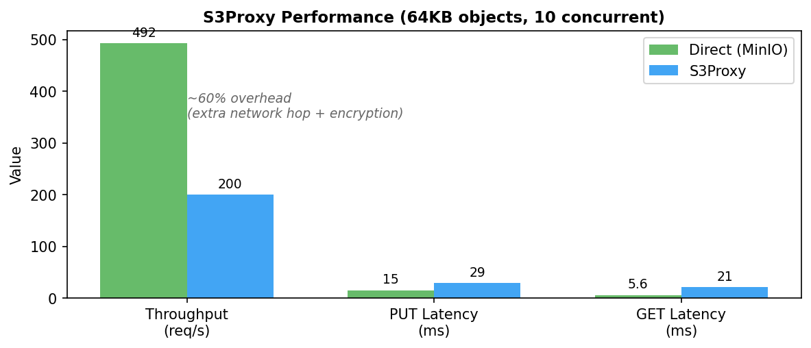

<p align="center">
  
  
  
  
</p>

<h1 align="center">S3Proxy</h1>

<p align="center">
  <strong>Transparent encryption for your S3 storage. Zero code changes required.</strong>
</p>

<p align="center">
  Drop-in S3 proxy that encrypts everything on the fly with military-grade AES-256-GCM.<br/>
  Your apps talk to S3Proxy. S3Proxy talks to S3. Your data stays yours.
</p>

---

## Why S3Proxy?

Most teams store sensitive data in S3. Most of that data? **Unencrypted at the application level.**

S3's server-side encryption is great, but your cloud provider still holds the keys. With S3Proxy, **you** control encryption. Every object is encrypted before it ever touches S3.

```
┌──────────────┐         ┌──────────────┐         ┌──────────────┐
│              │         │              │         │              │
│   Your App   │ ──────▶ │   S3Proxy    │ ──────▶ │   AWS S3     │
│              │         │  (encrypts)  │         │  (storage)   │
│              │ ◀────── │  (decrypts)  │ ◀────── │              │
└──────────────┘         └──────────────┘         └──────────────┘
      ▲                        │
      │                        │
    Plain                 AES-256-GCM
    Data                  Encrypted
```

---

## ✨ Features

🔐 **End-to-End Encryption** — AES-256-GCM with per-object keys wrapped via AES-KWP

🔄 **100% S3 Compatible** — Works with any S3 client, SDK, or CLI. No code changes.

⚡ **Blazing Fast** — Async Python with HTTP/2, uvloop, and streaming I/O

📦 **Multipart Support** — Large file uploads just work, encrypted seamlessly

✅ **AWS SigV4 Verified** — Full signature verification for all requests

🏗️ **Production Ready** — Redis-backed state, horizontal scaling, Kubernetes native

---

## 🚀 Quick Start

### One-liner with Docker

```bash
docker run -p 4433:4433 \
  -e S3PROXY_ENCRYPT_KEY="your-super-secret-key" \
  -e AWS_ACCESS_KEY_ID="AKIA..." \
  -e AWS_SECRET_ACCESS_KEY="..." \
  ghcr.io/<owner>/sseproxy-python:latest
```

### Or run locally

```bash
# Install
pip install -e .

# Configure
export S3PROXY_ENCRYPT_KEY="your-super-secret-key"
export AWS_ACCESS_KEY_ID="AKIA..."
export AWS_SECRET_ACCESS_KEY="..."

# Run
python -m s3proxy.main --no-tls
```

### Point your app at it

```bash
# Instead of s3.amazonaws.com, use localhost:4433
aws s3 --endpoint-url http://localhost:4433 cp secret.pdf s3://my-bucket/

# That's it. Your file is now encrypted in S3.
```

---

## 🏛️ Architecture

S3Proxy uses a **layered key architecture** for maximum security:

| Layer | Key | Purpose |
|-------|-----|---------|
| **KEK** | Derived from your master key | Wraps all DEKs |
| **DEK** | Random per object | Encrypts actual data |
| **Nonce** | Random/deterministic | Ensures uniqueness |

Your master key never touches S3. DEKs are wrapped and stored as object metadata. Even if someone accesses your bucket, they get nothing but ciphertext.

---

## ⚙️ Configuration

All settings via environment variables (prefix: `S3PROXY_`):

| Variable | Default | Description |
|----------|---------|-------------|
| `ENCRYPT_KEY` | *required* | Your master encryption key |
| `HOST` | `s3.amazonaws.com` | S3 endpoint |
| `REGION` | `us-east-1` | AWS region |
| `PORT` | `4433` | Listen port |
| `NO_TLS` | `false` | Disable TLS |
| `REDIS_URL` | `redis://localhost:6379/0` | Redis for multipart state |
| `MAX_CONCURRENT_UPLOADS` | `10` | Parallel upload limit |
| `MAX_CONCURRENT_DOWNLOADS` | `10` | Parallel download limit |
| `LOG_LEVEL` | `INFO` | Logging verbosity |

---

## 🐳 Deploy to Production

### Docker Compose (with Redis)

```bash
docker-compose -f e2e/docker-compose.e2e.yml up
```

### Kubernetes with Helm

```bash
# Pull from GitHub Container Registry (OCI)
helm install s3proxy oci://ghcr.io/<owner>/charts/s3proxy-python \
  --set config.encryptKey="your-key" \
  --set redis.enabled=true
```

The Helm chart includes:
- 3 replicas by default
- Redis HA with Sentinel
- Health checks & readiness probes
- Configurable resource limits

---

## 🧪 Testing

```bash
# Run all tests
pytest

# With coverage
pytest --cov=s3proxy

# E2E tests (requires Docker)
./e2e/test-e2e-fast.sh
```

---

## 📊 Performance



*64KB objects, 10 concurrent connections, 3×30s runs. ~60% overhead is primarily from the extra network hop (Client→Proxy→S3) plus encryption.*

S3Proxy is built for throughput:

- **Streaming I/O** — Large files never buffer in memory
- **HTTP/2** — Connection multiplexing & pooling
- **uvloop** — 2-4x faster than default asyncio
- **Horizontal scaling** — Redis-backed state, run N replicas

---

## 🛡️ Security Model

| Threat | Mitigation |
|--------|------------|
| S3 bucket breach | All data encrypted with AES-256-GCM |
| Key extraction from S3 | DEKs wrapped with KEK, KEK never stored |
| Request tampering | Full AWS SigV4 signature verification |
| Replay attacks | Nonce uniqueness per object |

---

## 🤝 Contributing

PRs welcome! Please include tests for new functionality.

```bash
# Setup dev environment
uv sync

# Run tests before submitting
pytest
```

---

## 📄 License

MIT

---

<p align="center">
  <sub>Built with 🔐 by engineers who believe encryption should be easy.</sub>
</p>
# s3proxy-python
